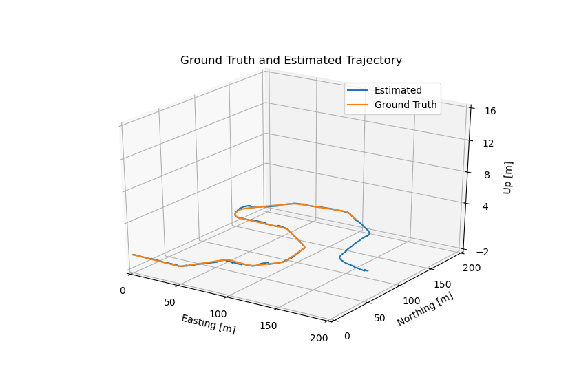

# State Estimation using ES-EKF




## Overview

This repository is the capstone project for Coursera's [State Estimation and Localization for SDC](https://www.coursera.org/learn/state-estimation-localization-self-driving-cars?) course as a part of [Self-Driving Cars Specialization](https://www.coursera.org/specializationsself-driving-cars).

The objective is developing a full vehicle state estimator, using data from the [CARLA](https://carla.org/) simulator utilizing LIDAR , IMU and GNSS sensors measurements using Error-State Extended Kalman Filter, to determine the vehicle position and orientation on the road at a high update rate.


## Description

The project has three different parts:

1. The implementation of the estimator with known calibration matrix for the transformation between sensors frames.

2. The transformation matrix is altered intentionally to produce miscalibration so that a tuning is needed to acheive a good results.

3. The data from external sensors (GNSS and LIDAR) is lost for a short period to explore the effect of the sensors dropout.


This repository consists of:

* ##### [es_ekf.py](https://github.com/HossamKhalil-hub01/State-Estimation-using-ES-EKF/blob/master/es_ekf.py):

    Is the python script in which the estimator is implemented for the first part of the project.

* ##### [es_ekf_pt2.py](https://github.com/HossamKhalil-hub01/State-Estimation-using-ES-EKF/blob/master/es_ekf_pt2.py):

    The second case where the transformation matrix is changed in this block:

    ```python

    # Incorrect calibration rotation matrix (for the second part of the project)
    # not accurate clibration is provided so tuning is needed
    # corresponding to Euler RPY angles (0.05, 0.05, 0.05).

    C_li = np.array([
         [ 0.9975 , -0.04742,  0.05235],
         [ 0.04992,  0.99763, -0.04742],
         [-0.04998,  0.04992,  0.9975 ]
    ])

    ```

* ##### [es_ekf_pt3.py](https://github.com/HossamKhalil-hub01/State-Estimation-using-ES-EKF/blob/master/es_ekf_pt3.py):

    The last part where the input data is changed so that sensors measurements is lost for a period of time.

    the new data is imported in this block :

    ```python
    ################################################################################
    with open('data/pt3_data.pkl', 'rb') as file:
        data = pickle.load(file)
    ```
    As `pt3_data.pkl` is the file containing the data used for this part


* ##### [Results](https://github.com/HossamKhalil-hub01/State-Estimation-using-ES-EKF/tree/master/Results):

    This folder contains the output resutls and trajectories for each part of the project.


* ##### [data](https://github.com/HossamKhalil-hub01/State-Estimation-using-ES-EKF/tree/master/data):

    Contains the data extracted from the carla simulator part 1 and 2 uses [pt1.data.pkl](https://github.com/HossamKhalil-hub01/State-Estimation-using-ES-EKF/blob/master/data/pt1_data.pkl) file, while part 3 uses [pt3_data.pkl](https://github.com/HossamKhalil-hub01/State-Estimation-using-ES-EKF/blob/master/data/pt3_data.pkl) file.

* ##### [rotations.py](https://github.com/HossamKhalil-hub01/State-Estimation-using-ES-EKF/blob/master/rotations.py):

    implements Quaternion class and other usefull functions to handle rotation operations.


## Dependencies

* [Python 3](https://www.python.org/downloads/)
* [matplotlib](https://matplotlib.org/)
* [numpy](https://numpy.org/)
